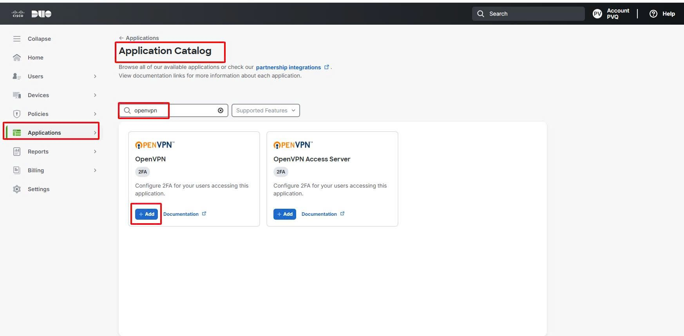
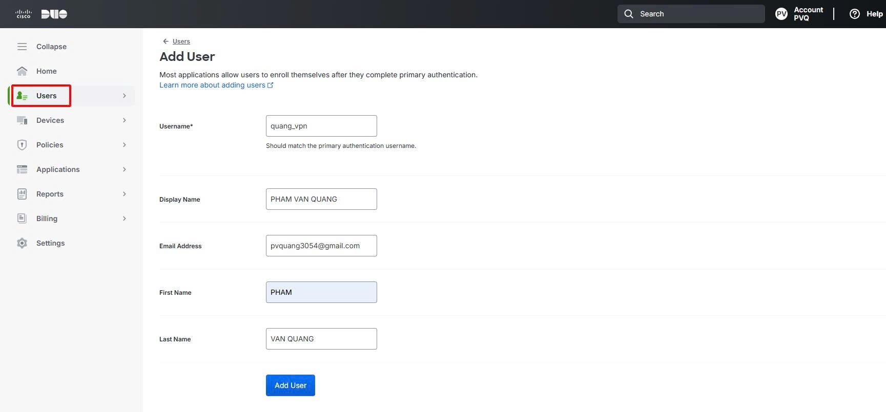
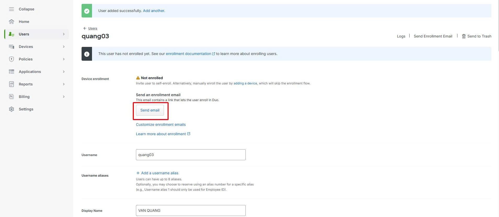
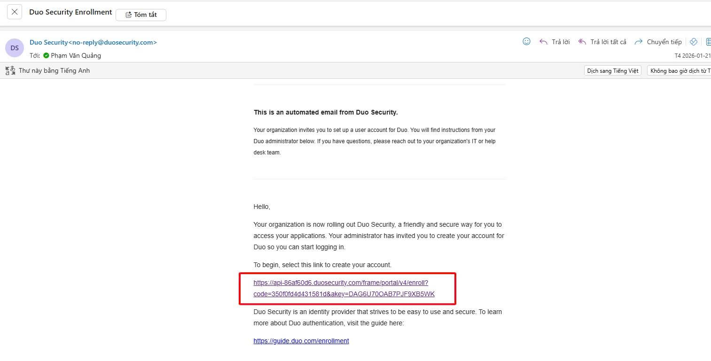
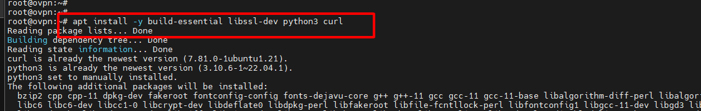
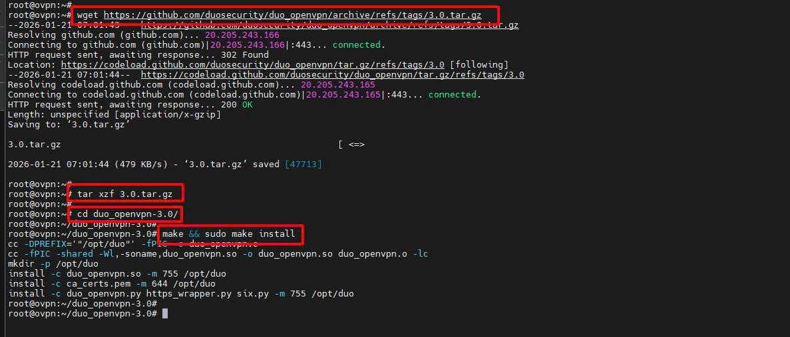
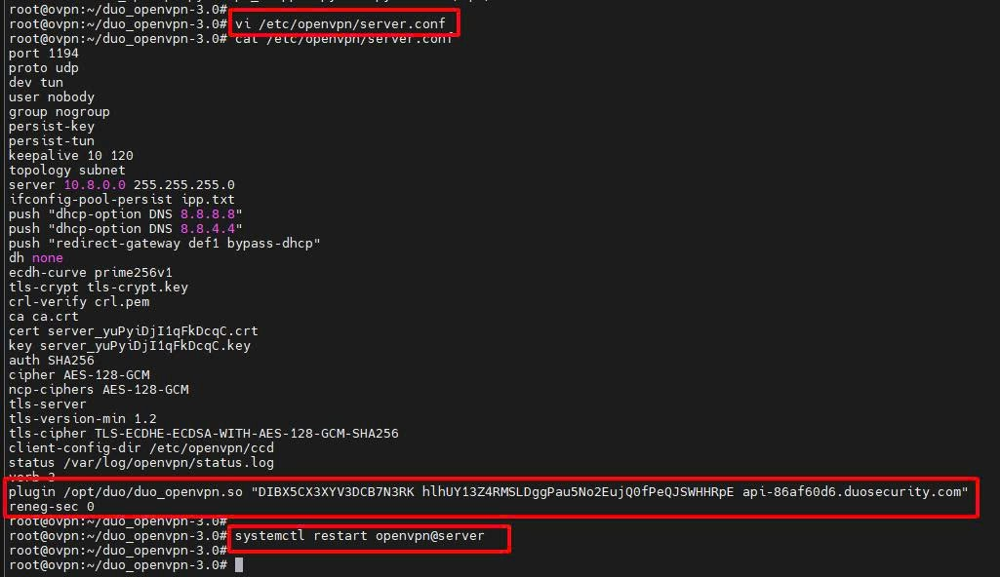
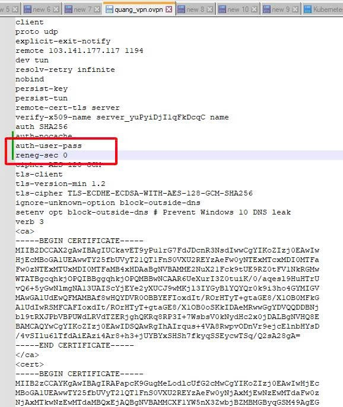
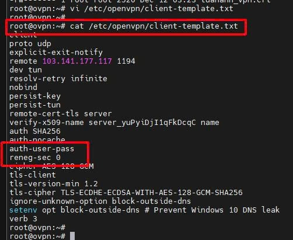
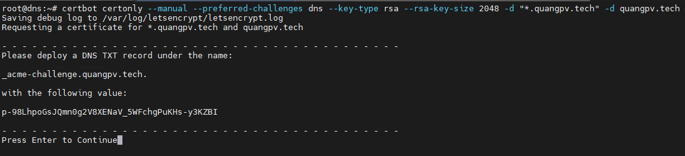

 ## 1. HƯỚNG DẪN CẤU HÌNH 2FA CHO OPENVPN DÙNG DUO

> Link hướng dẫn cài đặt từ trang chủ Duo: https://duo.com/docs/openvpn

> Điều kiện tiên quyết
- Đã cài sẵn OpenVPN Server
- Đã có tài khoản quản trị Duo (Admin Panel)

### Tích hợp OpenVPN Application vào Duo
Applications → Application Catalog -> OpenVPN -> Add



### Tạo User
Username được tạo trên Duo phải giống Username trên OenVPN Server
<p>
Users -> Users -> Add User -> Nhập thông tin User
<p>
 



Đối với trường hợp bạn đã từng cài Duo Mobile và đã kích hoạt sđt + app thì khi add user mới rồi gắn cùng số điện thoại, Duo sẽ tự nhận biết thiết bị đã được trust rồi, không cần kích hoạt nữa
<p>
Đối với trường hợp thiết bị chưa từng kết nối với Duo tiến hành kích hoạt như sau

> Edit User và nhấn Send email


<p>

> Mail kích hoạt sẽ được gửi đến mail đã nhập trước đó, nhấn vào link trên mail để active kết nối Duo với thiết bị và setup theo hướng dẫn.



### Build và install Plugin Duo trên OpenVPN Server
> Cài đặt các gói cần thiết
``` shell
apt install -y build-essential libssl-dev python3 curl
```



> Download package Duo_openvpn sau đó tiến hành giải nén và cài đặt
``` shell
wget https://github.com/duosecurity/duo_openvpn/archive/refs/tags/3.0.tar.gz
tar xzf 3.0.tar.gz
cd duo_openvpn-3.0
make && sudo make install
```


### Cấu hình thêm Plugin Duo vào OpenVPN Server
> Chỉnh sửa file cấu hình VPN /etc/openvpn/server.conf và thêm 2 dòng sau vào
``` shell
plugin /opt/duo/duo_openvpn.so "IKEY SKEY API_HOST"
reneg-sec 0
```

> Lưu ý thay thông tin "IKEY SKEY API_HOST" bằng thông tin xác thực của OpenVPN Application trên Duo và restart service OpenVPN
``` shell
systemctl restart openvpn@server
```





> Thêm 2 dòng sau vào Client Profile để active xác thực 2FA cho user
``` shell
auth-user-pass
reneg-sec 0
```



> Có thể thêm vào Template luôn để khi chạy Scipt thì sẽ tự sinh Profile có thông tin này luôn không cần chỉnh tay




> Lệnh để xem log VPN dùng khi cần kiểm tra lỗi
``` shell
journalctl -u openvpn@server -f
```

Import profile vào app OpenVPN Connect
 - Username: nhập bất kỳ không cần đúng user VPN đã tạo
 - Password: nhập push để đẩy thông báo về điện thoại hoặc nhập code sinh ra từ app Duo Mobile
 - Private Key Password: nhập password khi tạo user vpn (đối với user tạo không password thì không có ô này)




