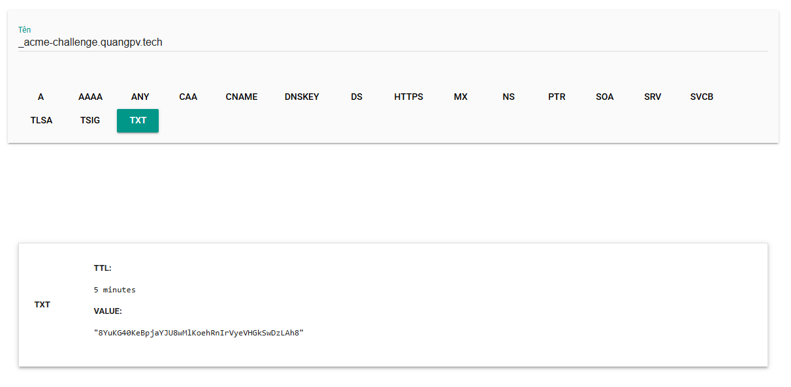
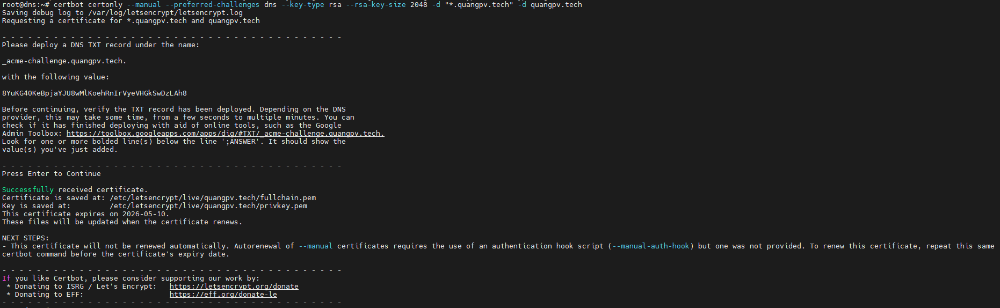
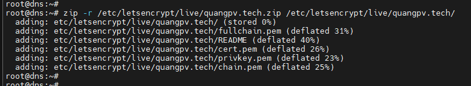

### Cài đặt Certbot

> Centos
``` shell
yum -y install certbot
```

> Ubuntu
``` shell
apt -y install certbot
```

### Tạo Certificate
> Chạy lệnh sau để tạo cert
``` shell
certbot certonly --manual --preferred-challenges dns --key-type rsa --rsa-key-size 2048 -d "*.quangpv.tech" -d quangpv.tech
```


> Add record TXT với value được tạo ở lệnh trên
<p>

  

### Kiểm tra đúng value là được
> Dùng cmd
``` shell
nslookup -type=TXT _acme-challenge.quangpv.tech 8.8.8.8
```
<p>


> Dùng web: https://toolbox.googleapps.com/apps/dig/
<p>

  

### Hoàn thành tạo cert
> Sau khi xác nhận ok nhấn enter để tiếp tục



> Nén thư mục chứa cert để download về
``` shell
zip -r /etc/letsencrypt/live/quangpv.tech.zip /etc/letsencrypt/live/quangpv.tech/ certonly --manual --preferred-challenges dns --key-type rsa --rsa-key-size 2048 -d "*.quangpv.tech" -d quangpv.tech
```




